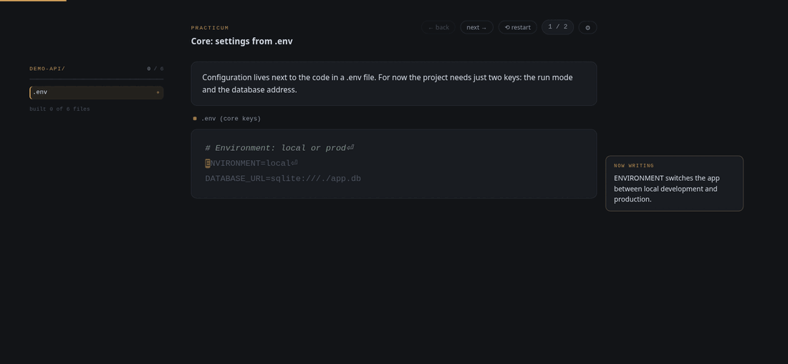
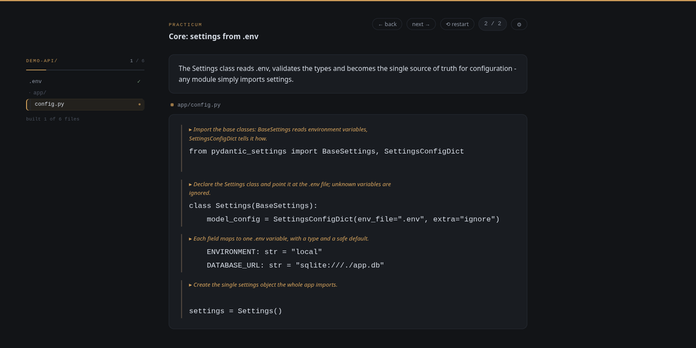
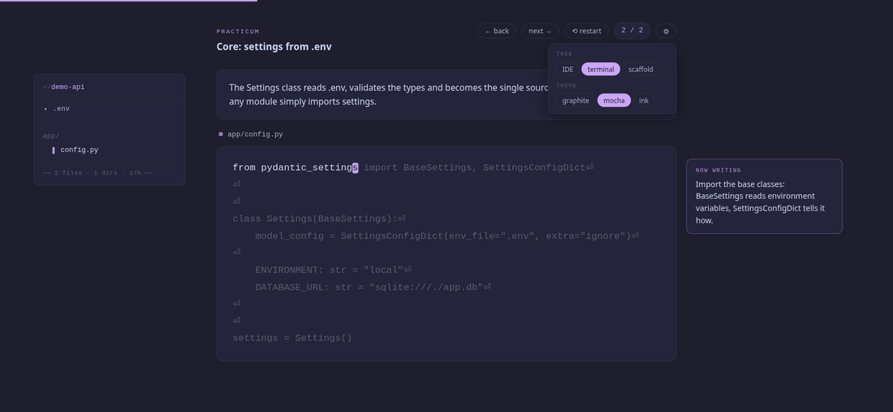

# Vibe Typing

[English](README.md)

Плагін Claude Code: навчальний typing-тренажер на базі твого власного
коду. Самодостатні HTML-уроки — передрук реального коду проекту з
простими поясненнями і покроковим гайдом по кожному блоку.

Вміст уроків (пояснення, нотатки, плани курсів) генерується **рідною
мовою користувача** — тією, якою ти спілкуєшся з Claude. UI сторінки
уроку — англійською.



## Команди

- `/vibe-typing:practicum` — урок з diff поточного чекпоінта
- `/vibe-typing:how-to` — курс по існуючому проекту: «як написати його
  з нуля», крок за кроком
- `/vibe-typing:technology [назва]` — курс по технології: без
  аргументу — інвентаризація стеку; технологія є в проекті — курс
  «як вона інтегрована»; нема — реальна інтеграція в окремій гілці
  (за явною згодою) і курс з її diff

## Встановлення

```bash
claude plugin marketplace add semtexfromua/vibe-typing
claude plugin install vibe-typing@vibe-typing
```

З локального клона (для розробки):

```bash
claude plugin marketplace add /шлях/до/vibe-typing
claude plugin install vibe-typing@vibe-typing
```

## Використання

- `/vibe-typing:practicum` — незакомічені зміни або останній коміт;
  `/vibe-typing:practicum HEAD~3..` — діапазон комітів.
- `/vibe-typing:how-to` — перший виклик аналізує проект, показує план
  курсу і знахідки; після підтвердження пише `.practicum/course.md`
  і генерує урок 01; кожен наступний виклик — наступний урок.
  `/vibe-typing:how-to src/api` — курс лише по підсистемі.
- `/vibe-typing:technology redis` — курс «як Redis інтегрований у цей
  проект» (стан: `.practicum/course-redis.md`).

Уроки: `.practicum/lessons/*.html` у поточному проекті.

## Сторінка уроку

- Друкуєш код посимвольно; відступи, коментарі та докстрінги
  пролітаються автоматично (видно, але не друкуються).
- Нотатка «now writing» їде за курсором і пояснює поточний блок.
- Дерево проекту зліва росте по мірі друку — файли з'являються, нові
  теки анонсуються, прогрес рахується по всьому курсу.
- `← back` / `next →` — навігація фрагментами; `⟲ restart` — скинути
  урок; незавершений прогрес відновлюється автоматично.
- Після завершення — `↺ review lesson`: перечитати всі фрагменти
  з усіма нотатками у вигляді яскравих коментарів над блоками коду.
- `⚙` — налаштування вигляду: стиль панелі дерева (IDE / terminal /
  scaffold) і тема (graphite / mocha / ink). Вибір зберігається
  в localStorage.

Режим перегляду:



Теми і стилі дерева:



## Розробка

Зібрати тестовий урок з golden-файла:

```bash
python3 - <<'EOF'
from pathlib import Path
tpl = Path('skills/practicum/template.html').read_text()
lesson = Path('sample-lesson.json').read_text()
Path('/tmp/practicum-test.html').write_text(tpl.replace('__LESSON_JSON__', lesson.replace('</', '<\\/')))
EOF
xdg-open /tmp/practicum-test.html
```

Установка копіює плагін у кеш — правки навичок у репо НЕ підхоплюються
живо. Після змін: підніми `version` у `.claude-plugin/plugin.json`
(оновлення спрацьовує лише при зміні версії) і виконай:

```bash
claude plugin update vibe-typing@vibe-typing-local
```

Спеки: `docs/superpowers/specs/`
